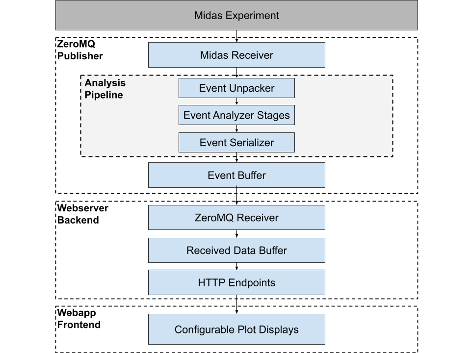

# Software Overview

## Why Three Applications?

The system is split into three distinct applications to separate concerns and optimize performance:

1. **ZeroMQ Publisher (C++)** handles real-time data acquisition, low-level preprocessing, and event publishing. Its C++ implementation allows for high-performance, parallelized pipelines using Intel TBB.

2. **ZeroMQ Receiver and FastAPI Webserver (Python)** serves as a flexible backend that receives, buffers, and optionally processes event data from the C++ publisher, exposing it via HTTP endpoints. This layer can be extended to serve or corroborate data from multiple publishers (experiments) and other data sources, or alternatively, one can run a separate API instance per experiment to isolate data streams. Additionally, the FastAPI backend can be swapped with a different webserver implementation, so long as it provides the same HTTP endpoints required by the webapp.

3. **Data Quality Monitor Webapp (JavaScript / React)** provides an interactive frontend for visualization and monitoring. Built with React and Plotly, it focuses exclusively on the user interface and dynamic charting, leaving data acquisition and backend processing to other components. Plot packages for specific experiments can be added as remote plugins, enabling a modular and extensible frontend architecture. The client interacts with this webserver, allowing for any user to construct their own custom view without 

This separation allows each component to use the most suitable language, library ecosystem, and runtime optimizations while maintaining modularity, scalability, and ease of maintenance. Furthermore, each component can run on its own machine, allowing resources to be separated for performance-critical applications.

---

## Data Flow Diagram For Midas Experiment Data
{: style="max-width:100%; height:auto;"}

### ZeroMQ Publisher (C++)

* **MIDAS Receiver** – Reads event data directly from a running MIDAS experiment.
* **Analysis Pipeline** – Framework to build pipelines out of modular stages, for the publisher use case we generally follow this pattern:
  * **Event Unpacker**: Translates raw MIDAS banks into structured data.
  * **Event Analyzer Stages**: Optional processing and filtering, e.g., histogramming or feature extraction.
  * **Event Serializer**: Converts processed data into serialized objects (JSON) suitable for transmission.
* **Event Buffer** – Stores serialized events before publishing.
* Events are published over **ZeroMQ sockets** to downstream consumers.

---

### Webserver Backend (Python)

* **ZeroMQ Receiver** – Subscribes to events published by the C++ layer.
* **Received Data Buffer** – Buffers incoming events for short-term access.
* **HTTP Endpoints** – Expose buffered data through a REST API (e.g., GET requests for recent events or statistics, POST requests for configuration or control).
* This layer decouples the high-rate publisher from user-facing services, enabling scaling, validation, and integration of multiple data sources.

---

### Webapp Frontend (React / JavaScript)

* **Configurable Plot Displays** – Interactive dashboards built in React and Plotly.
* Pulls event data from the backend’s HTTP endpoints and dynamically renders charts.
* Plot packages can be extended through remote plugins, allowing experiment-specific visualizations without modifying the core webapp.

---

### Summary

This architecture provides a clean separation of concerns:

* **Publisher** handles acquisition and initial processing.
* **Backend** provides data access and management via APIs.
* **Frontend** focuses on visualization.

The modular design ensures that each component can evolve independently—for example, replacing MIDAS with another DAQ, swapping the backend for a different web framework, or customizing frontend plots for new experiments.

---

## Dependency Diagram

---

## ZeroMQ Publisher (C++)

---

## ZeroMQ Receiver and FastAPI Webserver (Python)

---

## Data Quality Monitor Webapp (JavaScript / React)

---